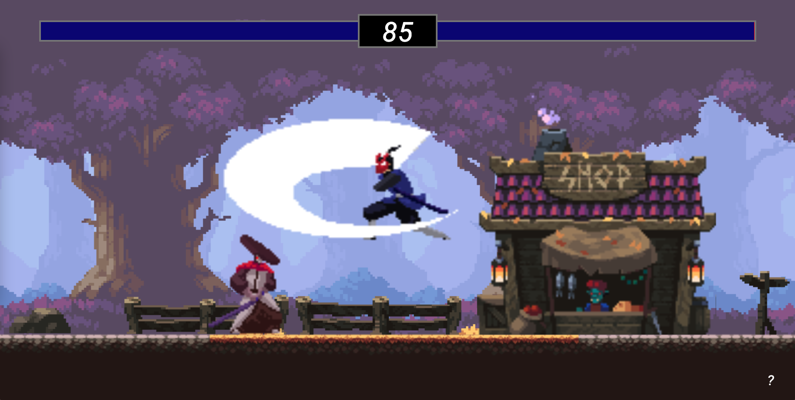

# Fighting Game

This is a simple fighting game build with pure html & javaScript with canvas.

Source: https://www.youtube.com/watch?v=vyqbNFMDRGQ&t=10726s

I also change something to make this game more fun to play.

Play the game: https://kallechen.github.io/fighting-web-game/

# How to play

- Player1: 
  - `A`: go left
  - `D`: go right
  - `W`: jump
  - `S`: attack
- Player2: 
  - `arrow left`: go left
  - `arrow right`: go right
  - `arrow up`: jump
  - `arrow down`: attack
